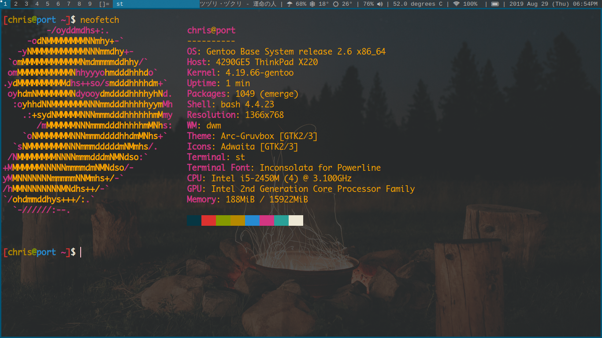
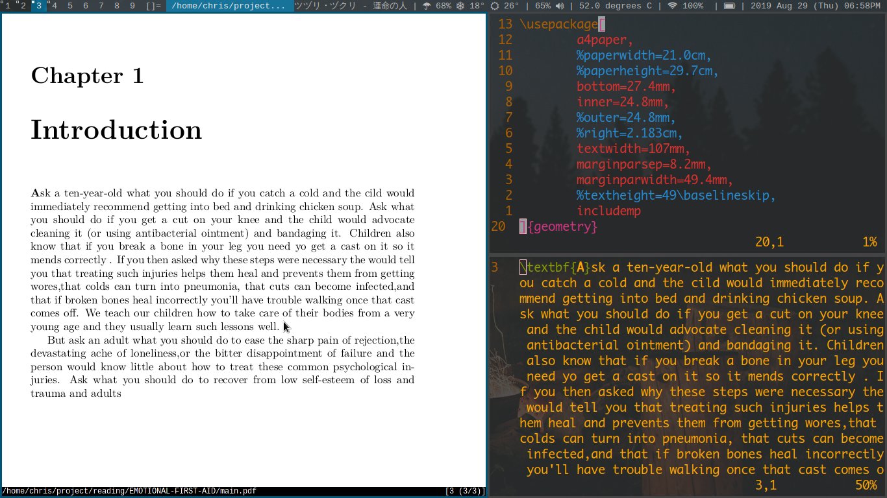
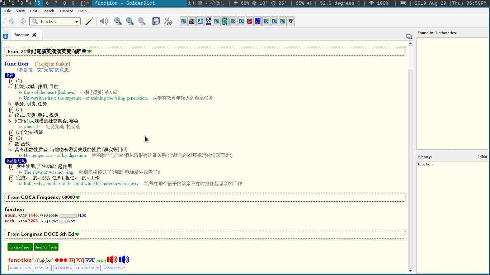

# 我的日常使用电脑配置

## 系统配置

~~ThinkPad W520 移动工作站~~

~~Macbook Air 2017 13inch~~

ThinkPad X220

## 软件系统

- Gentoo
- WM(dwm)
- input(fcitx)
- Terminal(ST)
- browser(google-chrome)
- bar(xsetroot)

## 系统截图

> INFO

> LaTeX

> Dict

## 配置文档

- [ThinkPad-W520](./docs/install.md)

- [Macbook-Air](./docs/README.md)

- [Mac OS 软件](./docs/Mac.md)

- (ThinkPad X220) 正在写中
